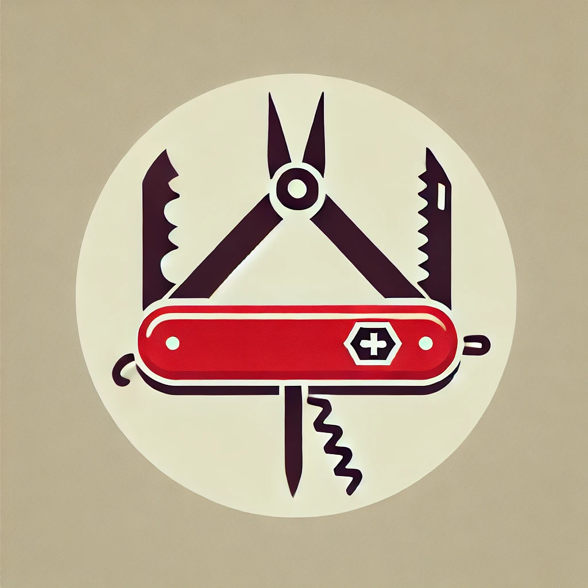

#  Complete Utility App (CUT)
### 📌 Your All-in-One Solution for Productivity, Media Management, and Security

  

 

  
  
  

---

## 📖 Overview
**Complete Utility App (CUT)** is a feature-packed desktop tool designed to simplify your digital life. With a seamless interface and robust functionalities, CUT combines media management, productivity tools, and security features into a single application.  

> **CUT** is your **ultimate Swiss Army knife** for handling tasks ranging from YouTube downloads to OCR text extraction and file encryption.  

---

## 🌟 Features
### 🔗 **YouTube Tools**
- 📥 Download videos in various resolutions and formats.
- 🎵 Extract audio directly from videos.
- 📄 Transcribe videos using built-in tools.

### 🖼️ **Media Tools**
- 📸 Convert image formats, resize images, and create PDFs from images.
- 📄 Merge, split, and manage PDF files.
- 🔄 Batch rename files with ease.

### 🧰 **Extra Tools**
- 🔍 OCR (Powered by Tesseract) for text extraction from images.
- 🔒 File encryption and decryption for securing sensitive files.
- 📲 QR code generation.
- 🎨 Customizable themes for personalized experience.

### 🔑 **Security**
- 🔐 Master password protection for safeguarding sensitive data.
- 📂 Encrypted storage for files and keys.

---

## 💻 System Requirements
- **Operating System:** Windows 7 or later  
- **Disk Space:** Minimum 700 MB  
- **RAM:** At least 512 MB  
- **Internet Connection:** Required for YouTube downloads and updates  

---

## 📦 Installation
1. **Download** the installer from the [Releases](https://github.com/0pen-sourcer/Complete-Utility-App/releases) page.  
2. **Run** the installer and follow the setup instructions.  
3. **Launch CUT** and start using its powerful features!  

> 📌 **Tesseract Language Update:** To add new languages, download them from [Tesseract GitHub](https://github.com/tesseract-ocr/tesseract) and place them in the app folder.

---

## 🚀 Usage
- **Access tools** through the user-friendly interface.  
- Detailed **instructions and troubleshooting tips** are available within the app.  

---

## 📌 Community & Contributions

- [Code of Conduct](./CODE_OF_CONDUCT.md)
- [Contribution Guidelines](./CONTRIBUTING.md)

---

## 📧 Contact
- **Instagram:** [@fissile_u235](https://www.instagram.com/fissile_u235)  
- **Email:** [ishantstech@gmail.com](mailto:ishantstech@gmail.com)  
- **Report Issues:** [GitHub Issues](https://github.com/0pen-sourcer/Complete-Utility-App/issues)  

---

## 🙏 Attribution & Respect

Complete Utility App (CUT) was proudly built by **Ishant Singh** ([@0pen-Sourcer](https://github.com/0pen-Sourcer)).  
If you're using or modifying this software, please retain all original credits.  

**This is an open-source community tool — not for unauthorized resale or rebranding.**

For any issues or requests, feel free to [email me](mailto:ishantstech@gmail.com).
---

## 📜 License
This project is licensed under the **GNU GPL v3**.  
Tesseract OCR is licensed under the **Apache License 2.0**.  

---

## 📚 Documentation
Complete documentation is provided within the app. Access it via the **Help menu**.

---

Thank you for using Complete Utility App 😊
