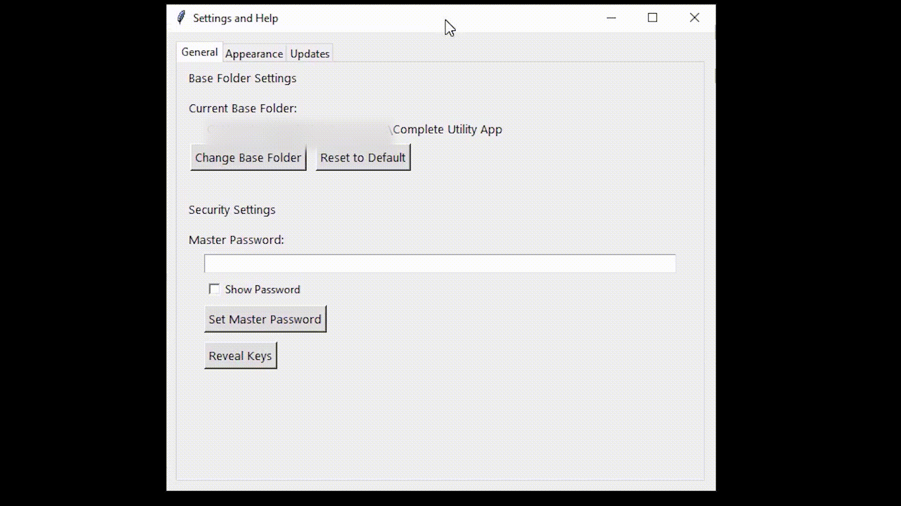
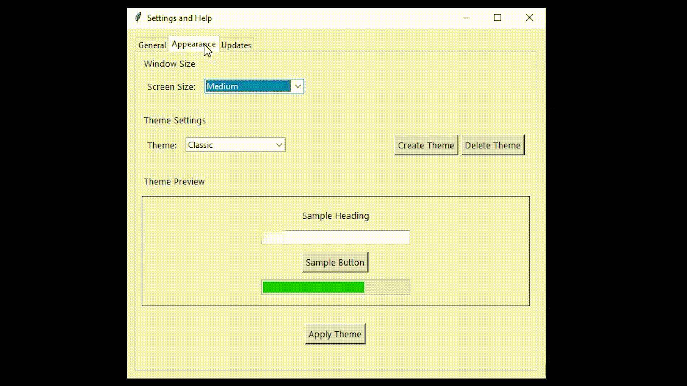
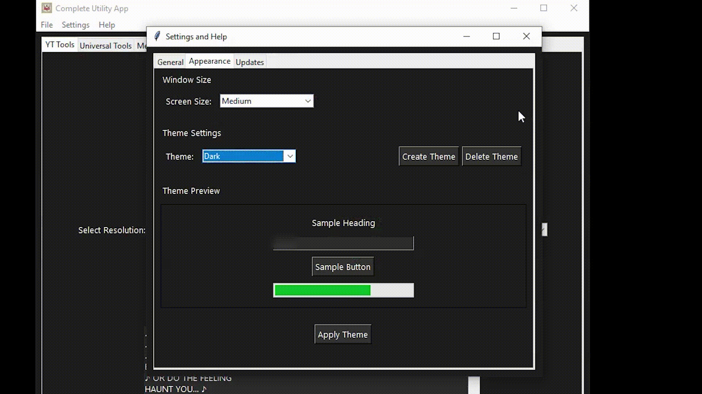
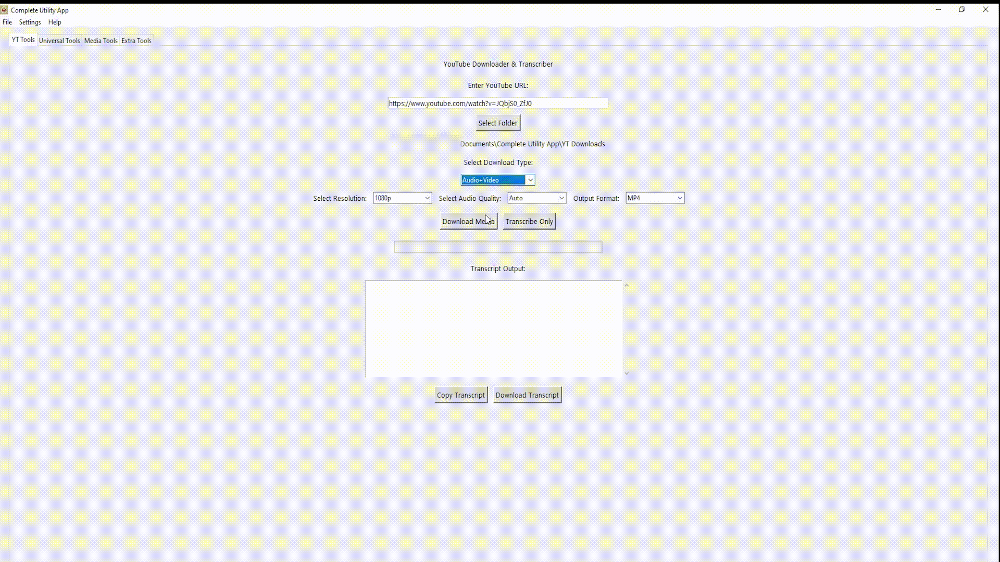
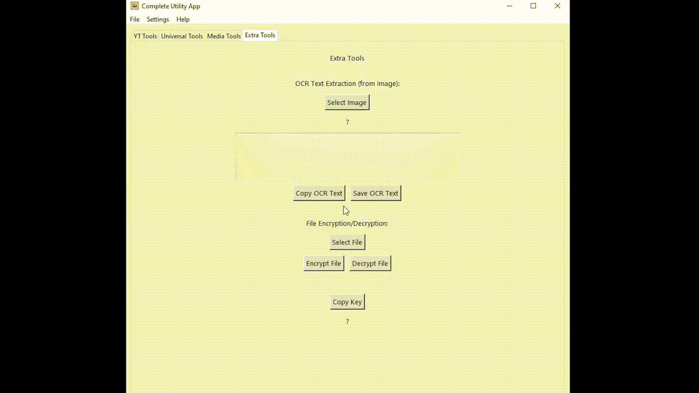
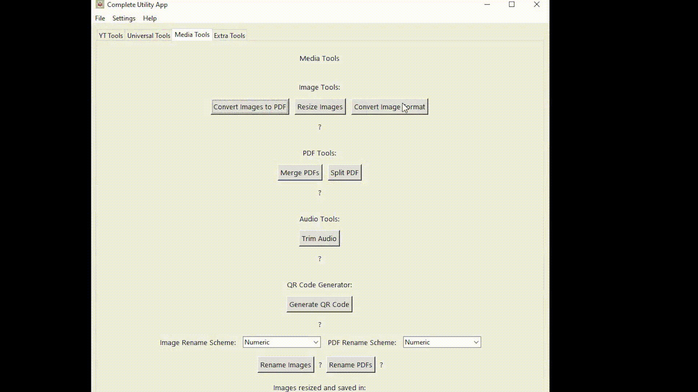
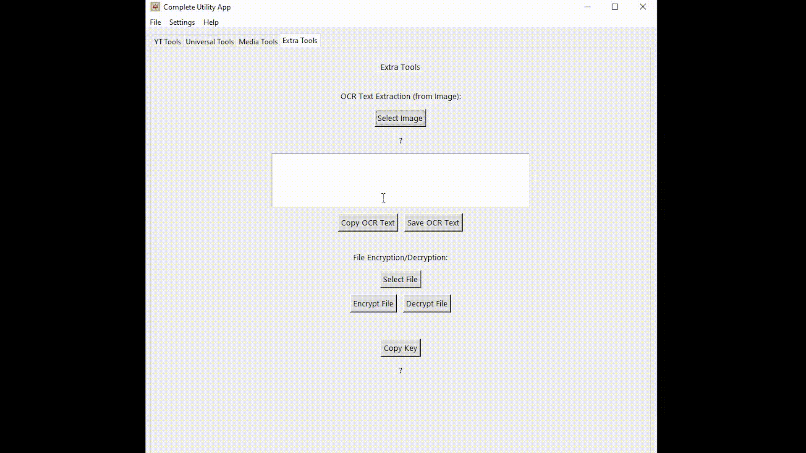
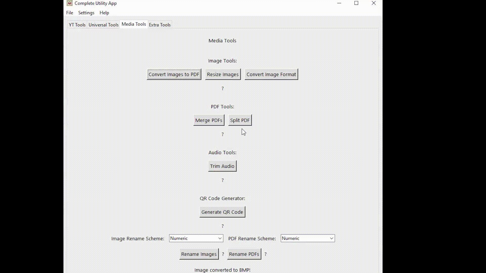
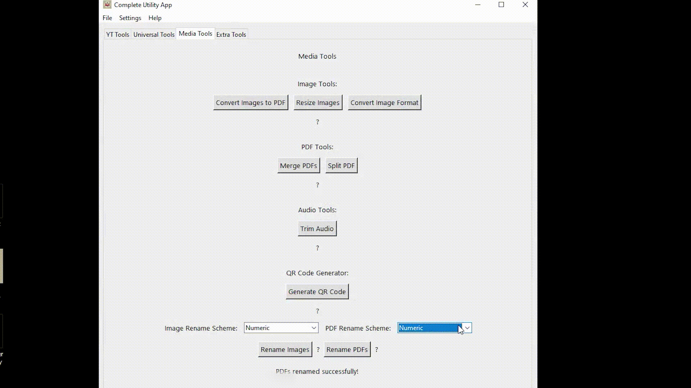
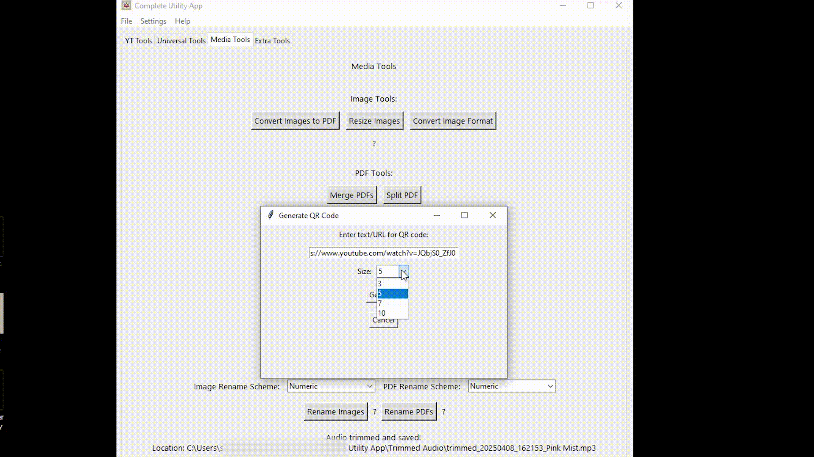

#  Complete Utility App (CUT)
### 📌 Your All-in-One Solution for Productivity, Media Management, and Security

  

 

  
  
  

---

## 📖 Overview
**Complete Utility App (CUT)** is a feature-packed desktop tool designed to simplify your digital life. With a seamless interface and robust functionalities, CUT combines media management, productivity tools, and security features into a single application.  

> **CUT** is your **ultimate Swiss Army knife** for handling tasks ranging from YouTube downloads to OCR text extraction and file encryption.  

---

## 🌟 Features
CUT brings together tools you'd normally need 10+ apps for — in a clean, unified experience.

### 🔗 YouTube Tools
- 📥 Download videos in various resolutions (144p to 8K) and formats (MP4, WEBM).
- 🎵 Extract audio directly from videos with quality options (128, 192, 320 kbps).
- 📄 Transcribe videos using built-in tools with fallback to audio-based transcription.
- ⚡ Support for standard YouTube videos, Shorts, embeds, and live streams.

### 🖼️ Media Tools
- 📸 Convert image formats between JPG, PNG, BMP, GIF, WEBP, and TIFF.
- 🎨 Add watermarks to images with customizable text, position, and opacity.
- 📐 Resize images in batch with custom dimensions.
- 📄 Convert multiple images to PDF format.
- 📑 Merge multiple PDFs into a single file.
- ✂️ Split PDFs by page ranges.
- 🎵 Trim audio files (MP3, WAV, OGG, M4A) by time.
- 🎬 Trim video files (MP4, AVI, MKV) using ffmpeg.
- 🔄 Batch rename files with numeric or alphabetic schemes.
- 🗜️ Create and extract ZIP archives from files and folders.

### 🧰 Extra Tools
- 🔍 OCR (Powered by Tesseract) for text extraction from images.
- 🔒 File encryption and decryption for securing sensitive files.
- 📲 QR code generation with customizable size.
- 🗣️ Text-to-Speech conversion (save as MP3).
- 📸 Screenshot capture (full screen or custom region).
- 🔐 Hash calculator (MD5, SHA1, SHA256, SHA512) for files and text.
- 🔑 Password generator with customizable length and character sets.
- 🎨 Color picker with HEX, RGB, and HSV values.
- 🎨 Customizable themes with ability to create your own.

### 🔑 Security
- 🔐 Master password protection for safeguarding sensitive data.
- 📂 Encrypted storage for files and keys.
- 🔑 Key revelation with password verification.
- 🛡️ Secure password generation with cryptographically strong randomness.
- 🔒 File integrity verification with hash calculation.

> 👇 **Want to see CUT in action? Check out the GIF previews of key features below.**

---

## 📽️ Feature Previews

  
Click to expand and preview CUT in action

**⚙️ General Settings**  

**🎨 Appearance Settings**  

**🎨 Custom Theme**  

**🖌️ Themes Panel**  

**🎥 YouTube Tools**  

**🧠 Download + Transcribe**  

**🔐 Encryption and Decryption**  

**🖼️ Image Converter**  

**🔠 OCR (Image to Text)**  

**📄 PDF Merge**  

**📝 Rename PDFs**  

**📲 QR Code Generator**  

**🛠️ And many more features!**

---

## 💻 System Requirements
- **Operating System:** Windows 7 or later  
- **Disk Space:** Minimum 700 MB  
- **RAM:** At least 512 MB  
- **Internet Connection:** Required for YouTube downloads and updates  

---

## 📦 Installation
1. **Download** the installer from the [Releases](https://github.com/0pen-sourcer/Complete-Utility-App/releases) page.  
2. **Run** the installer and follow the setup instructions.  
3. **Launch CUT** and start using its powerful features!  

> 📌 **Tesseract Language Update:** To add new languages, download them from [Tesseract GitHub](https://github.com/tesseract-ocr/tesseract) and place them in the app folder.

---

## 🚀 Usage
- **Access tools** through the user-friendly interface.  
- Detailed **instructions and troubleshooting tips** are available within the app.  

---

## 📌 Community & Contributions

- [Code of Conduct](./CODE_OF_CONDUCT.md)
- [Contribution Guidelines](./CONTRIBUTING.md)

---

## 📧 Contact
- **Instagram:** [@fissile_u235](https://www.instagram.com/fissile_u235)  
- **Email:** [ishantstech@gmail.com](mailto:ishantstech@gmail.com)  
- **Report Issues:** [GitHub Issues](https://github.com/0pen-sourcer/Complete-Utility-App/issues)  

---

## 🙏 Attribution & Respect

Complete Utility App (CUT) was proudly built by **Ishant Singh** ([@0pen-Sourcer](https://github.com/0pen-Sourcer)).  
If you're using or modifying this software, please retain all original credits.  

**This is an open-source community tool — not for unauthorized resale or rebranding.**

For any issues or requests, feel free to [email me](mailto:ishantstech@gmail.com).

---

## 📜 License
This project is licensed under the **GNU GPL v3**.  
Tesseract OCR is licensed under the **Apache License 2.0**.  

---

## ⚠️ Legal Disclaimer

**Complete Utility App is intended for personal and legal use only.**  
This tool provides downloading, conversion, and encryption features for educational and responsible usage.  
Users are solely responsible for complying with all applicable laws and platform terms.  
The developer does not condone or support piracy, copyright infringement, or illegal file access in any form.

---

## 📚 Documentation
Complete documentation is provided within the app. Access it via the **Help menu**.

---

Thank you for using Complete Utility App 😊
